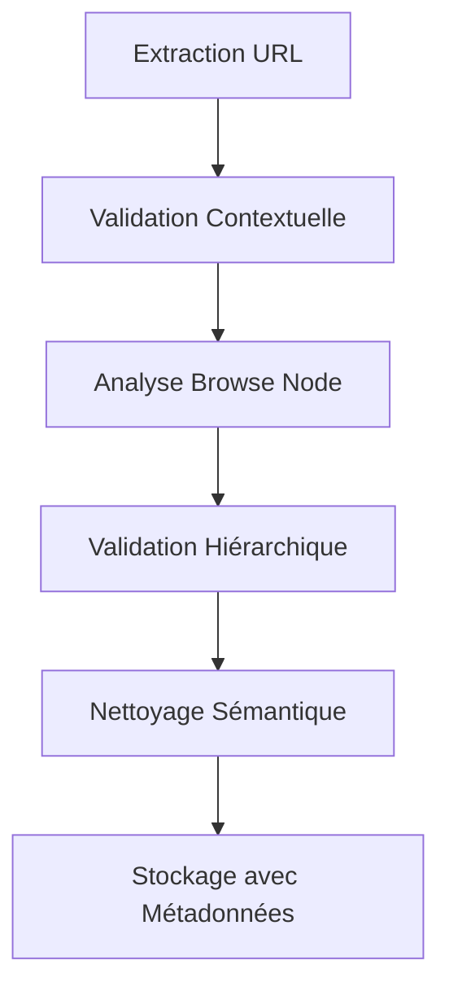

# 🚀 Meilleures Pratiques Scraping Catégories Amazon 2024-2025

## 📋 Sommaire
1. [🎯 Le Problème du Filtrage Actuel](#le-problème-du-filtrage-actuel)
2. [🏗️ Approche Contextuelle Recommandée](#approche-contextuelle-recommandée)
3. [🔧 Browse Nodes : La Clé du Succès](#browse-nodes--la-clé-du-succès)
4. [🛡️ Anti-Détection 2025](#anti-détection-2025)
5. [🧠 Filtrage Intelligent](#filtrage-intelligent)
6. [⚖️ Compliance et Légalité](#compliance-et-légalité)
7. [🏛️ Architecture Recommandée](#architecture-recommandée)

---

## 🎯 Le Problème du Filtrage Actuel

### ❌ Problème Identifié
L'approche actuelle de filtrage par **mots-clés simples** est **fondamentalement incorrecte** :

```python
# MAUVAIS - Trop restrictif
if 'informatique' in text_lower:
    return False  # ❌ Exclut les livres d'informatique !
```

### ✅ Pourquoi C'est Incorrect
- **\"Informatique\"** peut être :
  - 📚 **Livres techniques** sur l'informatique (VALIDE)
  - 💻 **Produits électroniques** informatiques (INVALIDE)
- Le **contexte** détermine la validité, pas le mot lui-même

---

## 🏗️ Approche Contextuelle Recommandée

### 🎯 Principe Fondamental
> **Filtrer basé sur l'ARBORESCENCE et le CONTEXTE, pas sur des mots-clés isolés**

### 🔍 Méthodes de Validation Contextuelle

#### 1. **Validation par URL Structure**
```python
def valider_url_livres(url):
    url_lower = url.lower()

    # ✅ Indicateurs POSITIFS
    indicateurs_livres = [
        'stripbooks',           # Section livres Amazon
        'node=301',            # Browse node livres (301061)
        '/b/?ie=UTF8&node=301' # URL browse livres
    ]

    # ❌ Indicateurs NÉGATIFS
    indicateurs_non_livres = [
        'electronics',    # Section électronique
        'computers',      # Section informatique
        'software'        # Section logiciels
    ]

    return any(ind in url_lower for ind in indicateurs_livres) and \
           not any(ind in url_lower for ind in indicateurs_non_livres)
```

#### 2. **Validation par Position Hiérarchique**
```python
def valider_position_hierarchique(chemin_categories):
    # Vérifier que le chemin passe par les bonnes catégories parent
    categories_livres_valides = [
        'Livres',
        'Sciences, Techniques et Médecine',
        'Scolaire et études',
        'Romans et polars',
        # etc.
    ]

    return any(cat in chemin_categories for cat in categories_livres_valides)
```

#### 3. **Analyse du Contexte de la Page**
```python
def analyser_contexte_page(soup):
    # Analyser le fil d'Ariane (breadcrumb)
    breadcrumb = soup.select('.a-breadcrumb a')
    chemin = [link.get_text(strip=True) for link in breadcrumb]

    # Vérifier si \"Livres\" est dans le chemin
    return 'Livres' in chemin or 'Books' in chemin
```

---

## 🔧 Browse Nodes : La Clé du Succès

### 📊 Statistiques Clés 2025
- **30,000+** catégories Amazon avec browse nodes uniques
- **Node 301061** = Catégorie racine des livres
- Structure **hiérarchique** : parent → enfants → petits-enfants

### 🎯 Utilisation des Browse Nodes

#### **API Officielle (Recommandée)**
```python
# Product Advertising API 5.0
browse_node_info = api.get_browse_node_info(node_id=301061)
print(f\"Catégorie: {browse_node_info.DisplayName}\")
print(f\"Enfants: {browse_node_info.Children}\")
```

#### **Scraping Web (Alternative)**
```python
def extraire_browse_node_url(url):
    # Extraire le browse node depuis l'URL
    match = re.search(r'node=(\d+)', url)
    return int(match.group(1)) if match else None

def est_sous_categorie_livres(browse_node_id):
    # Vérifier si le browse node est sous la branche 301061
    return est_descendant_de(browse_node_id, 301061)
```

---

## 🛡️ Anti-Détection 2025

### ⚠️ Défis Actuels
Amazon emploie des **mécanismes stricts** de détection de bots :
- Détection JavaScript avancée
- Analyse comportementale
- CAPTCHAs adaptatifs
- Rate limiting intelligent

### 🔧 Solutions Recommandées

#### 1. **Antidetect Browsers**
```python
# Multilogin, AdsPower, GoLogin
profile = create_unique_browser_profile()
driver = webdriver.Chrome(profile_path=profile.path)
```

#### 2. **Rotation de Proxies**
```python
proxies = ProxyRotator([
    'http://proxy1:port',
    'http://proxy2:port',
    # ...proxies résidentiels...
])

session = requests.Session()
session.proxies = proxies.get_next()
```

#### 3. **Comportement Humain**
```python
import random
import time

def human_delay():
    return random.uniform(1.0, 5.0)

def scrape_with_human_behavior():
    time.sleep(human_delay())
    # Mouvement de souris aléatoire
    # Scroll naturel
    # Patterns de clics humains
```

#### 4. **JavaScript Rendering**
```python
from playwright.async_api import async_playwright

async def scrape_with_js():
    async with async_playwright() as p:
        browser = await p.chromium.launch()
        page = await browser.new_page()
        await page.goto(url)
        content = await page.content()
```

---

## 🧠 Filtrage Intelligent

### 🎯 Approche Multi-Critères

#### **Exemple Concret : \"Informatique\"**

```python
def classifier_informatique(url, contexte, position_hierarchique):
    \"\"\"
    Classifier si 'informatique' est livre ou produit
    \"\"\"

    # ✅ LIVRE D'INFORMATIQUE
    if (
        'stripbooks' in url and
        'Sciences, Techniques et Médecine' in contexte and
        position_hierarchique.parent_node == 301061
    ):
        return 'LIVRE_VALIDE'

    # ❌ PRODUIT INFORMATIQUE
    elif (
        'computers' in url or
        'electronics' in url
    ):
        return 'PRODUIT_INVALIDE'

    # ⚠️ AMBIGÜ - Analyse plus poussée
    else:
        return 'ANALYSE_APPROFONDIE_REQUISE'
```

#### **Validation Contextuelle Complète**
```python
class ValidateurCategorieContextuel:
    def __init__(self):
        self.browse_node_livres = 301061

    def valider_categorie(self, nom_categorie, url, soup):
        \"\"\"Validation contextuelle complète\"\"\"

        # 1. Validation URL
        if not self.valider_url_structure(url):
            return False, \"URL non-livre\"

        # 2. Validation Browse Node
        node_id = self.extraire_browse_node(url)
        if not self.est_sous_branche_livres(node_id):
            return False, \"Browse node non-livre\"

        # 3. Validation Fil d'Ariane
        chemin = self.extraire_breadcrumb(soup)
        if not self.chemin_contient_livres(chemin):
            return False, \"Chemin hiérarchique incorrect\"

        # 4. Validation Sémantique
        contexte = self.analyser_contexte_semantique(soup)
        if not self.contexte_compatible_livres(contexte):
            return False, \"Contexte sémantique non-livre\"

        return True, \"Catégorie livre valide\"
```

---

## ⚖️ Compliance et Légalité

### 🚨 Avertissements Importants

#### **Terms of Service**
- Le scraping peut **violer** les conditions d'utilisation Amazon
- **Recommandation** : Utiliser l'API officielle quand possible

#### **Rate Limiting**
```python
# Respecter les limites
class RateLimiter:
    def __init__(self, max_requests_per_second=1):
        self.max_rps = max_requests_per_second
        self.last_request = 0

    def wait_if_needed(self):
        elapsed = time.time() - self.last_request
        min_interval = 1.0 / self.max_rps

        if elapsed < min_interval:
            time.sleep(min_interval - elapsed)

        self.last_request = time.time()
```

#### **Respect des Données**
- Ne pas **surcharger** les serveurs
- Implémenter un **cache intelligent**
- Scraper pendant les **heures creuses**

---

## 🏛️ Architecture Recommandée

### 🔧 Stack Technique 2025

```python
# Stack recommandé
SCRAPING_FRAMEWORK = \"Scrapy + Playwright\"
ANTI_DETECTION = \"Proxy Rotation + Browser Profiles\"
DATA_STORAGE = \"PostgreSQL + Redis Cache\"
MONITORING = \"Prometheus + Grafana\"
```

### 🔄 Pipeline de Traitement



### 📊 Implementation Complète

```python
class ScraperCategoriesAmazonAvance:
    def __init__(self):
        self.validateur = ValidateurCategorieContextuel()
        self.rate_limiter = RateLimiter(max_requests_per_second=1)
        self.proxy_rotator = ProxyRotator()

    async def scraper_categories_intelligemment(self, urls):
        resultats = []

        for url in urls:
            self.rate_limiter.wait_if_needed()

            # Scraping avec validation contextuelle
            soup = await self.fetch_with_context(url)
            categories = self.extraire_categories(soup)

            for categorie in categories:
                # Validation multi-critères
                est_valide, raison = self.validateur.valider_categorie(
                    categorie, url, soup
                )

                if est_valide:
                    resultats.append({
                        'nom': categorie,
                        'url': url,
                        'browse_node': self.extraire_browse_node(url),
                        'chemin_hierarchique': self.extraire_breadcrumb(soup),
                        'validation_contextuelle': True
                    })
                else:
                    logging.info(f\"Catégorie rejetée: {categorie} - {raison}\")

        return resultats
```

---

## 🎉 Conclusion

### ✅ Points Clés à Retenir

1. **Contexte > Mots-clés** : Le contexte détermine la validité
2. **Browse Nodes** : Utiliser la structure officielle Amazon
3. **Anti-détection** : Approche multicouche obligatoire en 2025
4. **Validation hiérarchique** : Vérifier tout le chemin parent→enfant
5. **API officielle** : Préférer l'API quand possible pour la compliance

### 🚀 Prochaines Étapes

1. **Refactoriser** le scraper actuel avec l'approche contextuelle
2. **Implémenter** la validation par browse nodes
3. **Intégrer** l'anti-détection multicouche
4. **Tester** sur un échantillon contrôlé
5. **Monitorer** les performances et ajuster

---

**📅 Document mis à jour : Septembre 2025**
**🔄 Version : 1.0**
**📊 Basé sur : Recherches WebSearch 2024-2025**